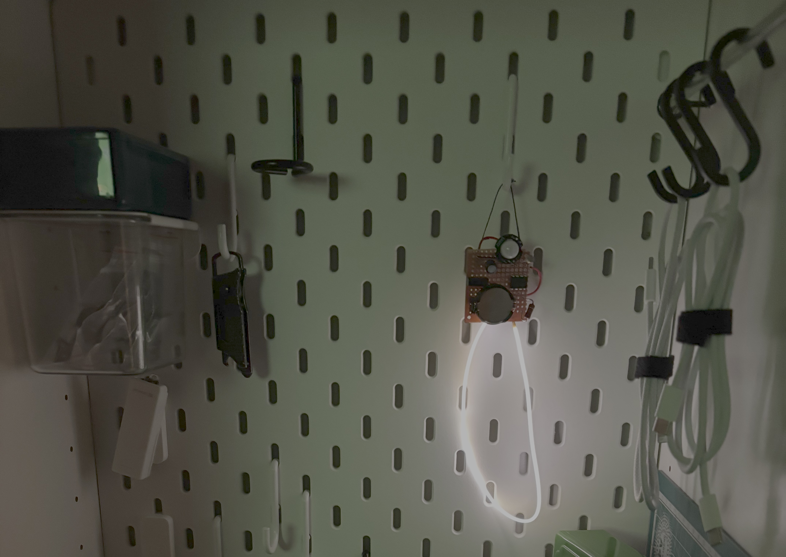

# Night light
I wanted some motion activated lights for when I fetch a tool late at night and I don't want to turn on the lights in my office. Ikea sells led-strips that can be controlled through trådfri, but I figured I could make it myself instead as a fun project.

In my case, an LED filament is used as a light source, but that can of course be substituted.

Project comes with two build configurations in `platformio.ini`, one for debug used directly with an esp8266, the other for prod which is written to the ATTiny. Programmed [using an ESP8266](https://github.com/submarines-and/esp8266-isp). 

## Parts
| Part    | Link |
| -------- | ------- |
| ATTiny85 | https://www.electrokit.com/en/attiny85-20pu-dip-8-8-bit-mcu-flash-8k     |
| LED filament 3v | https://www.electrokit.com/en/flexibelt-led-filament-3v-300mm-varmvit |
| Motion sensor (PIR) | https://www.electrokit.com/en/rorelsedetektor-pir-mini-sr602 |
| Photo resistor | https://www.electrokit.com/en/fotomotstand-cds-4-7-kohm |
| 10k Ohm resistor  | https://www.electrokit.com/en/motstand-2w-10kohm-510k    |
| 82 Ohm Resistor    | https://www.electrokit.com/en/motstand-1w-582ohm-82r    |
| 100uF Capacitor | https://www.electrokit.com/en/el.lyt-100uf-16v-105c-6.3x5mm |
| On/Off switch | https://www.electrokit.com/en/skjutomkopplare-1-pol-on-on-pcb-2.54mm-2 |
| Battery holder 2032 | https://www.electrokit.com/en/batterihallare-cr2016/2025/2032-plast |
| Experiment card for soldering | https://www.electrokit.com/en/experimentkort-70x50mm-pertinax |

Split voltage for photo resistor will vary based on which other resistor value is used to ground. If you use other parts, adjust `lightValue` in code so it makes sense.

